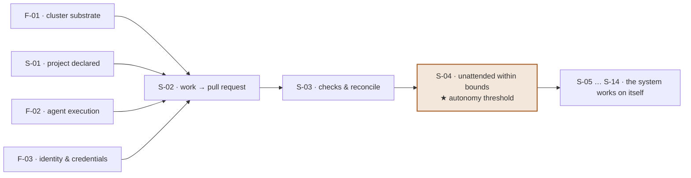

# Henia

**A Kubernetes-native harness for agentic software delivery.**
The agent still moves fast — it just doesn't get to choose the direction.

> *ἡνία* — Greek, "the reins". The name arrived after the thesis and described
> it better than the working title ever did. A straitjacket immobilises; reins
> steer without stopping motion.

---

## The problem

Every organisation now has three planes, and they do not meet:

- **Workloads** are migrating to cloud native.
- **CI/CD** is still detached from that migration.
- **Agentic development** is IDE-based — vibe coding — detached from both.

Nobody has merged the three into a curated, cloud-native workflow with real
guardrails. What that costs today is not hypothetical: teams use AI
ineffectively and burn real money doing it, for want of an inheritable best
practice. Every team reinvents the wheel and pays for the reinvention in token
spend.

And for the person usually holding this together — the architect — the cost is
sharper and quieter: **the SDLC lives in their head.** Nothing enforces how work
is supposed to flow, so every team drifts differently and the same process gets
re-established by hand, again, from memory.

## The thesis

GitOps centred configuration management on git. **Henia's ambition is to do the
same for agentic SDLC.**

The mechanism is one sentence: *the agent gets read-only access to the cluster,
and the only way out is a git commit that a reconciler applies.*

That single constraint is what makes the rest tractable. An agent that cannot
`kubectl patch` its way out of a failing deployment has to express the fix as a
change to the source of truth — reviewable, revertible, attributable, and
identical in shape to how a human would have done it.

## Core values

Each of these is a position we've already had to defend in writing, not a slogan.

| Value | What it means in practice |
| --- | --- |
| **Reins, not a straitjacket** | Constrain the *direction* of agent action, never its speed. Guardrails that slow the loop down get redesigned, not accepted. |
| **Git is the only write path** | Read-only cluster identity by construction. Every cluster change is a commit. No exceptions, no break-glass imperative escape. |
| **Work items are data, never instructions** | An agent's objective comes from the specification. The text that *triggered* the run is input to be handled, not a command to be obeyed. |
| **Nothing approves itself** | No agent approves or merges its own work. No change reaches the cluster without passing review. |
| **Bounded by construction** | Work on any item is capped in attempts and in spend. Every running agent can be stopped on demand. Exhaustion hands back what was learned rather than failing silently. |
| **Everything is attributable** | Every action traces to one agent run and one work item. "The AI did it" is not an acceptable audit answer. |
| **Honest about what it is not** | Adopters are told plainly what they're taking on, including which risks stay theirs. See [Non-goals](#what-henia-deliberately-does-not-do). |
| **Its own proof** | The primary success criterion is *Henia builds Henia unattended*. Until that's true, the claims are unproven and we say so. |

Guardrails are mapped explicitly against the **OWASP Top 10 CI/CD Security
Risks** and the **OWASP Top 10 for Agentic Applications** — every requirement
names the entries it closes, and the residual risks we *don't* close are
published to adopters rather than quietly inherited.

## Who this is for

**Software / Solution Architects** who have designed a process that only exists
in their own head, and want it enforced by something other than repetition.

**DevOps and platform teams** who are being told agents will revolutionise
operations, and who have already discovered what happens when you put an LLM in
front of a live cluster.

**Security-minded platform engineers** who want the agentic threat model handled
architecturally rather than by prompt engineering — and who'd like to argue with
our mapping.

**Open-source builders** tired of choosing between proprietary agent
orchestrators. Henia is Apache-2.0 and intended as something to build on; if the
idea proves out, the ambition is the CNCF incubator.

### Who it isn't for — yet

**Henia requires spec-driven maturity and does not supply it.** It works when
someone has already carefully designed and specified the project. If your specs
live in a Slack thread, Henia will faithfully automate the wrong thing. The
market already has good educational resources for SDD; we point at them rather
than duplicating them.

It is also **not an IDE copilot**. If you want faster typing, this is the wrong
tool. This is about what happens *after* the code is written and *before* it
reaches a cluster.

## Where it's going

The north star is **S-04: the loop runs unattended within bounds.** Everything
before it is built by hand; everything after it is work the system can take on
itself.

Full detail — 4 foundations, 14 slices, prerequisites, risks and open unknowns —
lives in [`context/foundation/roadmap.md`](context/foundation/roadmap.md).

### What Henia deliberately does not do

- **Agents do not talk to each other.** They run in parallel but never
  coordinate, delegate, or message. This removes an entire class of inter-agent
  risk by declining the capability rather than building a control for it.
- **It does not harden your existing environment.** Your forge, pipeline engine
  and registry stay your responsibility, and we say so explicitly.
- **Working knowledge is not pooled across projects.** Per-repository scoping is
  deliberate context protection — general advice hinders an agent more than it
  helps.

## Status: early, and honest about it

This is a **proof of concept in active construction**, not a product you can
adopt today. As of August 2026 the cluster substrate (F-01) is being built:
a pinned k3s cluster, ingress, a read-only cluster identity, and telemetry
collection are standing. There is no product code yet — what exists is the
harness and the specification behind it.

The specification is unusually complete for a project this young, and that's on
purpose: Henia is its own worked example of the precondition it demands.

There's also a deadline. This work is heading for a conference talk —
*"Str-AI-tjacket: A Tale of Marrying Agentic AI and Declarative GitOps"* — an
engineer-to-engineer post-mortem, scars included. See
[`content/CFP.md`](content/CFP.md).

## Come argue with us

**This is the part we actually want.** The talk ends on an open question and so
does the repository: *knowing these constraints, how would you design the future
of AI-driven platform engineering?*

Concretely, here's where your input lands hardest:

- **The roadmap items are tickets.** Every foundation, slice and debt item on the
  roadmap has an issue. Comment on the one you have opinions about — especially
  if you think the ordering is wrong.
- **The open questions are genuinely open.** Both
  [`prd.md`](context/foundation/prd.md) and
  [`roadmap.md`](context/foundation/roadmap.md) carry an *Open Questions*
  section that names what we haven't settled and who owns each one. These are
  invitations, not placeholders.
- **Tell us where the straitjacket has a hole.** The read-only boundary is the
  central claim. The first real exposure we found had nothing to do with RBAC —
  it was a credential sitting in a working tree. We'd rather you find the next
  one than an audience member.
- **[`JOURNEY.md`](JOURNEY.md) is the append-only record of what bit us** — dead
  ends, false assumptions, workarounds we're not proud of. Being wrong on the
  record is the point. If you've hit the same wall, that's worth an entry.
- **Disagree with a core value.** Each one above survived an argument; several
  were rewritten by the objection. That process is still running.

Issues and discussion live on the project's Gitea instance, which is the
canonical remote — Gitea-first is a design position, not an accident, since
provider-agnosticism is a day-one requirement with Gitea as the reference
implementation. A GitHub mirror exists at `heniadev/henia`.

If you're contributing code, start with [`AGENTS.md`](AGENTS.md) — it documents
the ground rules, including the ones that exist because we already broke them.

## License

Apache License 2.0 — see [`LICENSE`](LICENSE).
