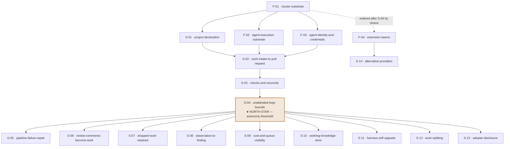

> Source: `context/foundation/prd.md` (v1), with prior material from the
> `## Forward: technical-roadmap` block of `context/foundation/shape-notes.md`,
> `context/foundation/tech-stack.md` and `context/foundation/infrastructure.md`.
> This is a living document — edit it in place rather than regenerating for
> small corrections. Regeneration archives the previous copy first.

## Vision recap

Three planes that every organisation now has and which do not meet: workloads
migrating to cloud native, delivery pipelines detached from that migration, and
agentic development detached from both. Henia's ambition is to centre agentic
software delivery on git the way GitOps centred configuration management on it.
The cost today is ineffective AI use and money burned on it, for want of an
inheritable best practice; for the architect specifically, the cost is that the
development lifecycle lives in their head and is re-established by hand for
every team.

## North star

A **north star** is the single item everything else is ordered toward — the one
whose completion proves the central hypothesis.

**S-04: the loop runs unattended within bounds.**

> Chosen because the sequencing goal is to reach the point where Henia can
> develop Henia as early as possible. S-02 and S-03 make one unit of work travel
> from git to reconciled cluster state with the agent holding only read access —
> the hypothesis of the whole design. But it is S-04 that makes it safe to walk
> away from: bounded spend, attributable actions, a concurrency limit and a
> queue. Before S-04 the loop is a demonstration; at S-04 it is something you can
> leave running against its own repository, and every item after it becomes work
> the system can take on itself. That threshold is what the goal names.

## At a glance

| ID | Change ID | Outcome (user can …) | Prerequisites | PRD refs | Status |
| --- | --- | --- | --- | --- | --- |
| F-01 | `cluster-substrate` | — (prerequisite) | — | FR-085, FR-270, FR-470 | ready |
| S-01 | `project-declaration` | bring a project under management by declaring it | F-01 | FR-450, FR-460, FR-180 | proposed |
| F-02 | `agent-execution-substrate` | — (prerequisite) | F-01 | FR-030, FR-040, FR-240, FR-330 | proposed |
| F-03 | `agent-identity-and-credentials` | — (prerequisite) | F-01 | FR-130, FR-140, FR-190, FR-200, FR-370 | proposed |
| S-02 | `work-intake-to-pull-request` | see a waiting unit of work become a pull request unaided | S-01, F-02, F-03 | US-01, FR-010, FR-060, FR-070, FR-170, FR-210 | proposed |
| S-03 | `checks-and-reconcile` | see a merged change validated and reach the cluster | S-02 | US-01, FR-080, FR-090, FR-110, FR-220 | proposed |
| S-04 | `unattended-loop-bounds` | leave the loop running without supervising it | S-03 | FR-050, FR-230, FR-250, FR-280, FR-290 | proposed |
| S-05 | `pipeline-failure-repair` | see a failed pipeline repaired without asking | S-04 | FR-020, FR-025, FR-100, FR-105 | proposed |
| S-06 | `review-comments-become-work` | leave review comments and get changed code back | S-04 | US-03, FR-420 | proposed |
| S-07 | `dropped-work-retained` | drop work without losing why | S-04 | US-04, FR-430 | proposed |
| S-08 | `observation-to-finding` | see the running system produce findings | S-04 | US-02, FR-112, FR-113, FR-114, FR-116, FR-117 | proposed |
| S-09 | `cost-and-queue-visibility` | see what is running, what waits, and what it cost | S-04 | FR-300, FR-320, FR-310 | proposed |
| S-10 | `working-knowledge-store` | see the system improve at working on this project | S-04 | FR-340, FR-350, FR-390, FR-415 | proposed |
| S-11 | `harness-self-upgrade` | approve the framework's own upgrade as a change | S-04 | FR-360 | proposed |
| S-12 | `work-splitting` | see oversized work divided into descendants | S-04 | US-05, FR-440 | proposed |
| S-13 | `adopter-disclosure` | understand what adopting Henia commits them to | S-04 | FR-185 | proposed |
| F-04 | `extension-seams` | — (prerequisite) | F-01 (ordered after S-04 by choice) | FR-120, FR-400 | proposed |
| S-14 | `alternative-providers` | run Henia against a different provider | F-04 | FR-150, FR-160, FR-380, FR-410 | proposed |
| D-01 | `narrow-cluster-api-allowlist` | — (operational debt) | `devserver-setup` | — | proposed |

### Progression to the north star

Everything left of S-04 is built by hand; everything right of it is work the
system can take on itself.

## Streams

A **stream** is a grouping of items that follow one chain of prerequisites — a
navigation aid only, carrying no authority over the order below.

| Stream | Theme | Chain | Note |
| --- | --- | --- | --- |
| A | Substrate | F-01 → S-01 → F-02 → F-03 | Everything that must exist before an agent can do anything |
| B | The loop | S-02 → S-03 → S-04 → S-05 | The main path and its closure; contains the north star |
| C | Human interaction | S-06 → S-07 → S-13 | Where people meet the system and what they are told |
| D | Observation and operability | S-08 → S-09 | Seeing the running system and what it costs |
| E | Self-improvement | S-10 → S-11 → S-12 → F-04 → S-14 | What the system does to itself once it can work |

## Baseline

*as of 2026-08-18.* The **baseline** is the state of the existing codebase at
the time of research — the one part of this document that goes stale on its own
and is re-probed rather than copied forward on regeneration. Probed directly
rather than by delegation, this session having no subagent capability available.

| Layer | Verdict | Evidence |
| --- | --- | --- |
| frontend | absent | no manifest and no framework configuration anywhere in the tree |
| backend / API | absent | no module definition, no entrypoints, no request handlers |
| data | absent | no schema and no migrations — consistent with the PRD's position that everything durable lives in git |
| auth | partial | `devcontainer/k8s/rbac.yaml` defines a read-only cluster identity bound to a view role, deliberately excluding secret contents; `devcontainer/k8s/generate-kubeconfig.sh` issues its credentials. Development-harness identity only; the product's own identity handling is absent |
| deploy / infra | partial | `devcontainer/Dockerfile`, `devcontainer/docker-compose.yml`, `devcontainer/run.sh`, and `devcontainer/k8s/` including a secrets-encryption patch and a reconciliation-service patch. No pipeline definitions of any kind |
| observability | absent | no logging, error-tracking or metrics reference in any tracked file |

25 tracked files, none of them product code.

## Foundations

A **foundation** is a cross-cutting prerequisite with no user-visible effect of
its own; it may exist only where it names what it unlocks, and only for a layer
the baseline reports absent or partial.

### F-01: Cluster substrate

- **Outcome:** the framework runs in a cluster, can read the state of that
  cluster without being able to change it, and exposes its own operational
  telemetry for collection.
- **Change ID:** `cluster-substrate`
- **PRD refs:** FR-085, FR-270, FR-470
- **Unlocks:** S-01 — a project cannot be declared into a framework that is not
  running, and nothing downstream can be verified without the ability to read
  back what actually happened in the cluster.
- **Prerequisites:** —
- **Parallel with:** none (everything else descends from it)
- **Blockers:** none. The ordered hardware was delivered and verified on
  2026-08-19 — `tachiko.kondi.net` (88.99.160.8), a bare Ubuntu 26.04 machine
  with nothing installed beyond the base system. A **blocker** is something the
  team cannot resolve alone; this one has resolved, and the local cluster is no
  longer a substitute for development. Full findings in
  `context/foundation/infrastructure.md` § *Delivered hardware*.
- **Unknowns:** whether the platform version available matches what the scaffold
  targets — owner: user, blocking: no; unchanged, and resolved by choosing the
  k3s version at install rather than by discovery.
  - *Resolved 2026-08-19 — redundant storage:* yes. mdraid RAID1 across both
    NVMe devices for swap, `/boot` and `/`, all three arrays clean. Storage is
    mirrored, so the risk register's "unprotected node-local storage" reads
    milder than written.
  - *Raised 2026-08-19 — the host firewall does not exist yet.* The
    infrastructure document's perimeter model restricts port 6443 to known
    addresses at the host firewall; no firewall is currently active. Harmless
    while only sshd listens, and it must be in place before k3s starts serving
    the API. Part of this change, not a separate one.
- **Risk:** first in the order because everything reads back through it; the
  read-only identity is also the central claim of the conference talk, so
  getting it wrong is expensive twice.
- **Status:** ready

### F-02: Agent execution substrate

- **Outcome:** an agent process can be started in an isolated sandbox, keep its
  workspace for the life of its unit of work, be stopped on demand into a stated
  recoverable condition, and have what it left behind resumed or removed.
- **Change ID:** `agent-execution-substrate`
- **PRD refs:** FR-030, FR-040, FR-240, FR-330
- **Unlocks:** S-02 — there is no way to intake work without something to run it
  in; and the stop-and-recover path is what makes running anything unattended
  reversible.
- **Prerequisites:** F-01
- **Parallel with:** F-03
- **Blockers:** none
- **Unknowns:** whether a supporting component's documented version ceiling
  conflicts with a current release — owner: user, blocking: no; unchanged, and
  the sharper form of the remaining risk here (Virtink documents cert-manager
  v1.0–v1.8).
  - *Partially resolved 2026-08-19 — the hardware side of the isolation
    question:* the delivered machine exposes `/dev/kvm`, carries the `vmx` CPU
    flag, has `kvm_intel` loaded and has nested virtualisation enabled. Virtink's
    hardware requirement is met. What remains untested is the cluster side —
    `--allow-privileged=true` and the privileged DaemonSet — which cannot be
    checked before F-01 installs k3s.
- **Risk:** still the deepest technical unknown in the roadmap, but its centre
  has moved. The pre-mortem's first domino was whether the hardware could
  virtualise at all; that is now answered yes, and what is left is configuration
  and version compatibility rather than capability.
- **Status:** proposed

### F-03: Agent identity and credentials

- **Outcome:** an agent acts under its own constrained identity, may reach only
  destinations allowed for its unit of work, and receives credentials once at
  start that cannot be obtained again from inside the sandbox.
- **Change ID:** `agent-identity-and-credentials`
- **PRD refs:** FR-130, FR-140, FR-190, FR-200, FR-370
- **Unlocks:** S-02 — an agent with no identity cannot open a pull request, and
  an agent with an unconstrained one cannot be left running.
- **Prerequisites:** F-01
- **Parallel with:** F-02
- **Blockers:** none
- **Unknowns:** whether the repository host's permission model is granular
  enough to express the constraint without the fallback recorded as
  nice-to-have — owner: user, blocking: no.
- **Risk:** placed before the first agent work rather than after it, because
  retrofitting a credential boundary onto a working loop means rewriting the
  loop.
- **Status:** proposed

### F-04: Extension seams

- **Outcome:** a provider implementation is loaded only when the project's
  declaration names it, and any general-purpose tool available to agents is
  governed by stated rules rather than judged case by case.
- **Change ID:** `extension-seams`
- **PRD refs:** FR-120, FR-400
- **Unlocks:** S-14 — a second implementation of any integration point is
  unplannable until the seam it plugs into exists and its loading path is
  reviewable.
- **Prerequisites:** F-01
- **Parallel with:** S-01, F-02, F-03, S-02, S-03, S-04, S-05, S-06, S-07, S-08,
  S-09, S-10, S-11, S-12, S-13
- **Blockers:** none
- **Unknowns:** none
- **Risk:** its only real dependency is F-01, but it is *ordered* after S-04 by
  choice rather than by necessity — building the seam before a second
  implementation exists means guessing its shape, and the goal is autonomy
  first. Recorded this way so the distinction between what must come earlier and
  what merely should is not lost.
- **Status:** proposed

## Slices

A **vertical slice** is one user-visible capability cut through every layer it
needs, rather than one layer built across every capability.

### S-01: A project is declared and an instance runs

- **Outcome:** an operator brings a project under management by declaring its
  configuration, and the framework creates and configures that project's
  instance; who may make that declaration is decided by the platform's own
  access control.
- **Change ID:** `project-declaration`
- **PRD refs:** FR-450, FR-460, FR-180
- **Prerequisites:** F-01
- **Parallel with:** none
- **Blockers:** none
- **Unknowns:** whether one instance should manage this repository alone or a
  group from the outset — owner: user, blocking: no (the requirement leaves the
  grouping to the person deploying).
- **Risk:** the first user-visible thing in the roadmap, and the smallest
  possible proof that the operator shape works before any agent exists.
- **Status:** proposed

### S-02: A waiting unit of work becomes a pull request

- **Outcome:** the framework picks up a unit of work from git with no human
  initiating the run, an agent changes and tests it in isolation against
  substitutes, and opens a pull request it cannot itself approve or merge. The
  text of the work item is treated as data throughout, never as instructions.
- **Change ID:** `work-intake-to-pull-request`
- **PRD refs:** US-01, FR-010, FR-060, FR-070, FR-170, FR-210
- **Prerequisites:** S-01, F-02, F-03
- **Parallel with:** none
- **Blockers:** none
- **Unknowns:** what constitutes an actionable work item in the repository's own
  conventions — owner: user, blocking: no.
- **Risk:** the first half of the north-star claim and the point at which the
  design either works or does not. Every prerequisite above exists to make this
  slice possible.
- **Status:** proposed

### S-03: A merged change is validated and reaches the cluster

- **Outcome:** the framework delivers pipeline configuration to git and the
  engine reconciles from there; checks covering linting, review and security run
  against the pull request; a change touching the pipeline's own definition is
  treated as privileged; and a merged change reconciles into the cluster.
- **Change ID:** `checks-and-reconcile`
- **PRD refs:** US-01, FR-080, FR-090, FR-110, FR-220
- **Prerequisites:** S-02
- **Parallel with:** none
- **Blockers:** none
- **Unknowns:** which release track of the reconciling engine to adopt — owner:
  user, blocking: no (the infrastructure research records that the choice
  silently changes which interface fields exist).
- **Risk:** completes the round trip from git to running system. Until this
  lands, nothing the agent produces has any effect.
- **Status:** proposed

### S-04: The loop runs unattended within bounds

- **Outcome:** several agents can run at once under a limit, work beyond that
  limit waits in a queue rather than being refused, work on a single item is
  bounded in attempts and spend and hands back what it learned on exhaustion,
  and every action is attributable to the agent run and work item that caused
  it.
- **Change ID:** `unattended-loop-bounds`
- **PRD refs:** FR-050, FR-230, FR-250, FR-280, FR-290
- **Prerequisites:** S-03
- **Parallel with:** none
- **Blockers:** none
- **Unknowns:** what attempt and spend bounds are actually appropriate — owner:
  user, blocking: no (a wrong bound is adjustable; an absent one is not).
- **Risk:** the north star. This is the threshold the sequencing goal names: the
  point at which the system can be left running against its own repository, and
  after which the remaining items become work it can take on itself. The
  infrastructure pre-mortem's likeliest failure — several agents exhausting one
  machine and taking the control plane with them — surfaces here first, which is
  why the concurrency limit is part of this slice rather than a later one.
- **Status:** proposed

### S-05: A failed pipeline becomes work and is repaired

- **Outcome:** the framework treats a failed pipeline run as a unit of work,
  distinguishes a failure caused by the change from one caused by the
  environment, re-enters intake with the failure, and the repairing pull request
  carries the agent's statement of what caused it.
- **Change ID:** `pipeline-failure-repair`
- **PRD refs:** FR-020, FR-025, FR-100, FR-105
- **Prerequisites:** S-04
- **Parallel with:** S-06, S-07, S-08, S-09, S-10, S-11, S-12, S-13, F-04
- **Blockers:** none
- **Unknowns:** how failure classification behaves before enough history exists
  to distinguish a flaky test from a real one — owner: user, blocking: no.
- **Risk:** the differentiating capability, deliberately placed after the
  threshold rather than before it — it is the first thing the system could
  plausibly help build.
- **Status:** proposed

### S-06: Review comments become changed code

- **Outcome:** a person leaves review comments on an agent-authored pull request
  and the pull request changes in response, rather than the agent replying.
- **Change ID:** `review-comments-become-work`
- **PRD refs:** US-03, FR-420
- **Prerequisites:** S-04
- **Parallel with:** S-05, S-07, S-08, S-09, S-10, S-11, S-12, S-13, F-04
- **Blockers:** none
- **Unknowns:** how to distinguish a comment that asks for a change from one
  that asks a question — owner: user, blocking: no.
- **Risk:** the widest exposure to hostile input in the design, on the artefact
  with the most participants; the PRD records this openly as the largest carried
  risk.
- **Status:** proposed

### S-07: Work is dropped without being forgotten

- **Outcome:** a person decides work should not proceed, the pull request is
  dropped, and what led to that decision is kept rather than discarded.
- **Change ID:** `dropped-work-retained`
- **PRD refs:** US-04, FR-430
- **Prerequisites:** S-04
- **Parallel with:** S-05, S-06, S-08, S-09, S-10, S-11, S-12, S-13, F-04
- **Blockers:** none
- **Unknowns:** what consumes the retained reasoning — owner: user, blocking: no
  (recorded in the PRD as an accepted open point).
- **Risk:** small, and it closes a terminal state the design otherwise lacks
  entirely.
- **Status:** proposed

### S-08: Observations become findings

- **Outcome:** the framework observes the running system after a change
  reconciles and files what clears a significance threshold as a finding;
  telemetry is treated as data and never as instructions; an ordinary finding
  becomes agent work only when a person promotes it, while a severe incident
  starts investigation immediately.
- **Change ID:** `observation-to-finding`
- **PRD refs:** US-02, FR-112, FR-113, FR-114, FR-116, FR-117
- **Prerequisites:** S-04
- **Parallel with:** S-05, S-06, S-07, S-09, S-10, S-11, S-12, S-13, F-04
- **Blockers:** none
- **Unknowns:** where the significance threshold sits, and what counts as a
  severe incident — owner: user, blocking: no.
- **Risk:** closes the cycle rather than ending it at deployment, and introduces
  a second entrance into intake that no human wrote.
- **Status:** proposed

### S-09: Cost and queue state are visible

- **Outcome:** the queue is triaged rather than served in arrival order with the
  basis visible, cost is attributable to a single work item and a single running
  agent, and a person can see at a glance how many agents run, what the limit
  is, and what waits.
- **Change ID:** `cost-and-queue-visibility`
- **PRD refs:** FR-300, FR-320, FR-310
- **Prerequisites:** S-04
- **Parallel with:** S-05, S-06, S-07, S-08, S-10, S-11, S-12, S-13, F-04
- **Blockers:** none
- **Unknowns:** whether actual spend is reportable from the provider or must be
  estimated from supplied rates — owner: user, blocking: no.
- **Risk:** the direct answer to the burned-token cost the vision names, and the
  thing that makes the loop legible to anyone watching it.
- **Status:** proposed

### S-10: The system improves at working on this project

- **Outcome:** agents write working knowledge into the repository where every
  change to it is reviewed, that knowledge is scoped to the repository, a
  recorded lesson enters the specification only when a person promotes it, and
  the framework learns where this project departs from a conventional lifecycle
  without ever weakening a fixed gate.
- **Change ID:** `working-knowledge-store`
- **PRD refs:** FR-340, FR-350, FR-390, FR-415
- **Prerequisites:** S-04
- **Parallel with:** S-05, S-06, S-07, S-08, S-09, S-11, S-12, S-13, F-04
- **Blockers:** none
- **Unknowns:** what a conventional lifecycle model contains before any project
  has departed from it — owner: user, blocking: no.
- **Risk:** carries the business rule itself. Everything before this slice runs a
  fixed lifecycle; this is where the product's distinguishing claim becomes true.
- **Status:** proposed

### S-11: The framework upgrades itself through review

- **Outcome:** when the upstream provider releases new capabilities, the
  framework opens a pull request against its own pinned version carrying
  verified provenance, rather than updating silently.
- **Change ID:** `harness-self-upgrade`
- **PRD refs:** FR-360
- **Prerequisites:** S-04
- **Parallel with:** S-05, S-06, S-07, S-08, S-09, S-10, S-12, S-13, F-04
- **Blockers:** none
- **Unknowns:** none
- **Risk:** the clearest demonstration available of the product working on
  itself, and the one path that would otherwise bypass every guardrail at once.
- **Status:** proposed

### S-12: Oversized work divides

- **Outcome:** a unit of work found too large is divided into descendants each
  carrying its own budget, the parent-descendant relationship survives the queue
  and its triage, and one lineage cannot divide more times than the cap allows.
- **Change ID:** `work-splitting`
- **PRD refs:** US-05, FR-440
- **Prerequisites:** S-04
- **Parallel with:** S-05, S-06, S-07, S-08, S-09, S-10, S-11, S-13, F-04
- **Blockers:** none
- **Unknowns:** where a slice should divide, which the PRD records as
  architectural judgement rather than bookkeeping — owner: user, blocking: no.
- **Risk:** depends on the queue and the budget model both existing, and the
  divide-cap is the guard against decomposition becoming an escape from bounds.
- **Status:** proposed

### S-13: Adopters are told what they take on

- **Outcome:** an adopting organisation is told plainly that granting write
  access to a repository grants the ability to direct that repository's agents,
  and which delivery-security risks the framework does not close.
- **Change ID:** `adopter-disclosure`
- **PRD refs:** FR-185
- **Prerequisites:** S-04
- **Parallel with:** S-05, S-06, S-07, S-08, S-09, S-10, S-11, S-12, F-04
- **Blockers:** none
- **Unknowns:** none
- **Risk:** the PRD flags that documentation ships last or not at all, and that
  three security entries rest on this one deliverable. Its position here is a
  bet that it will not be forgotten.
- **Status:** proposed

### S-14: A different provider can be plugged in

- **Outcome:** an alternative implementation of an integration point runs without
  changing the framework; a shipped interface authenticates through a pluggable
  provider; a working tool set is available without per-project setup, each tool
  declaring the destinations it needs; and a curated starting list of providers
  exists.
- **Change ID:** `alternative-providers`
- **PRD refs:** FR-150, FR-160, FR-380, FR-410
- **Prerequisites:** F-04
- **Parallel with:** S-05, S-06, S-07, S-08, S-09, S-10, S-11, S-12, S-13
- **Blockers:** none
- **Unknowns:** which second provider is worth implementing first — owner: user,
  blocking: no.
- **Risk:** last because it is the only slice built entirely from requirements
  the PRD marks as optional, and because a seam validated by a real second
  implementation is worth more than one designed in advance.
- **Status:** proposed

## Debt

A **debt item** is a corner cut deliberately while sprinting to the conference,
written up at the moment it was cut rather than reconstructed afterwards — the
practice recorded in the shape-notes forward block. It is not a vertical slice:
it delivers no new user-visible capability, so it lives here rather than among
the S-items. The point of shaping it now is that post-MVP work arrives already
shaped and can be picked up by the autonomous flow itself.

### D-01: The cluster API is reachable only from where it needs to be

- **Outcome:** the k3s API server on tachiko accepts connections from the
  addresses that actually operate it, rather than from an entire carrier's
  address space.
- **Change ID:** `narrow-cluster-api-allowlist`
- **PRD refs:** — (operational debt; no requirement behind it)
- **Prerequisites:** `devserver-setup`
- **Parallel with:** anything after `devserver-setup`
- **Blockers:** none
- **Corner cut, and why:** `devserver-setup` ships a 6443 allowlist covering all
  of AS12912 (T-Mobile Polska) — 47 announced prefixes, ~1,355,520 addresses —
  because the operator's egress address is carrier-assigned and a narrower rule
  risks a lockout at the worst possible moment. The exposure is real: every
  subscriber address in that AS can reach the control plane, and the prefix list
  drifts as BGP announcements change, so the rule also rots. Accepted knowingly
  on 2026-08-19 to avoid spending the setup window on a network problem.
- **Unknowns:** whether the operator's source address is stable enough for the
  single `46.205.216.0/21` prefix, or whether the end state is a VPN perimeter
  joining tachiko to the existing private network — owner: user, blocking: no.
- **Risk:** the kind of item that is never urgent until it is. It competes with
  product work against a fixed date, and the mitigation already shipped (a prefix
  refresh script) makes the wide rule *sustainable*, which is precisely what
  makes it easy to leave in place.
- **Status:** proposed

## Backlog Handoff

The **backlog handoff** is the mapping from roadmap items to the change folders
that `/101-new` will create.

| Roadmap ID | Change ID | Suggested issue title | Ready for `/101-plan` | Notes |
| --- | --- | --- | --- | --- |
| F-01 | `cluster-substrate` | Run the framework in a cluster with read-only sight of it | yes | Hardware blocker recorded; a local cluster substitutes for development |
| S-01 | `project-declaration` | Bring a project under management by declaring it | after F-01 | |
| F-02 | `agent-execution-substrate` | Start, stop and recover an isolated agent | after F-01 | Deepest technical unknown in the roadmap |
| F-03 | `agent-identity-and-credentials` | Give agents a constrained identity and read-once credentials | after F-01 | Parallel with F-02 |
| S-02 | `work-intake-to-pull-request` | Turn a waiting unit of work into a pull request unaided | after S-01, F-02, F-03 | First half of the north-star claim |
| S-03 | `checks-and-reconcile` | Validate a change and reconcile it into the cluster | after S-02 | |
| S-04 | `unattended-loop-bounds` | Make the loop safe to leave running | after S-03 | **North star** |
| S-05 | `pipeline-failure-repair` | Repair a failed pipeline without being asked | after S-04 | |
| S-06 | `review-comments-become-work` | Turn review comments into changed code | after S-04 | Largest carried input-exposure risk |
| S-07 | `dropped-work-retained` | Drop work without losing why | after S-04 | |
| S-08 | `observation-to-finding` | Turn observations of the running system into findings | after S-04 | |
| S-09 | `cost-and-queue-visibility` | Show what runs, what waits and what it cost | after S-04 | |
| S-10 | `working-knowledge-store` | Let the system improve at working on this project | after S-04 | Carries the business rule |
| S-11 | `harness-self-upgrade` | Upgrade the framework through its own review path | after S-04 | |
| S-12 | `work-splitting` | Divide oversized work into descendants | after S-04 | |
| S-13 | `adopter-disclosure` | Tell adopters what they are taking on | after S-04 | |
| F-04 | `extension-seams` | Make integration points declared and governed | after F-01 | Buildable early; ordered after S-04 by choice, not by dependency |
| S-14 | `alternative-providers` | Run against a different provider | after F-04 | Built entirely from optional requirements |
| D-01 | `narrow-cluster-api-allowlist` | Restrict the cluster API to the addresses that operate it | after `devserver-setup` | Debt cut on 2026-08-19; wide AS12912 allowlist shipped to avoid a lockout |

## Open Roadmap Questions

Carried from the PRD's own open questions — none is dropped silently — then
extended with what this roadmap work raised.

1. **Cross-instance spend has no ceiling.** Bounded by arithmetic the adopting
   organisation performs over published figures, not by anything the framework
   enforces. Carried from the PRD as an accepted limitation; it becomes
   material at S-09.
2. **The permission to bring a project under management sits with whoever
   administers the platform**, rather than with the owners of the repository
   being managed. Carried from the PRD; it becomes material at S-01.
3. **No target exists for how quickly a unit of work begins to be worked.**
   Declined deliberately during shaping; it becomes material at S-02.
4. **FR-085 has never been through a Socratic challenge** — added after the
   challenge round closed. It is the first requirement in F-01, so this is worth
   resolving before that change is planned.
5. **The conference proposal commits to material the PRD does not contain.**
   `content/CFP.md` names three friction points — a read-only agent validating
   manifests against admission controllers through ephemeral namespaces,
   bridging model pace against reconciliation loops through hook systems, and
   hardening against prompt injection that attempts privilege escalation. None
   of these map to a requirement. The roadmap cannot invent slices for them; if
   they are to be built rather than merely discussed, they go back through the
   requirements document first. Recorded here rather than parked because the
   commitment has a date attached.
6. **The starter identifier in the stack hand-off is not in the toolkit's
   registry**, so the scaffolding step will refuse it. This blocks the mechanical
   path into F-01, though not the manual one.

## Parked

Content that surfaced during shaping or research but has no requirements
coverage. **Parked** means recorded and deliberately not scheduled.

- **An interactive simulator teaching the toolkit.** Why parked: recorded in the
  shape-notes forward block as explicitly conditional on time, and stated there
  as not a commitment.
- **Forking an existing agent-runner project to avoid hand-building an
  interface.** Why parked: an open option in the forward block rather than a
  decision; S-14 covers the interface requirement itself, and the build-or-fork
  question belongs to that change's planning.
- **The ephemeral validation-namespace technique from the conference proposal.**
  Why parked: technically the most novel item in the talk, with no requirement
  behind it. Listed in the open questions above as well, because it carries a
  date the other parked entries do not.

## Done

<!-- Written only by /101-archive. -->
